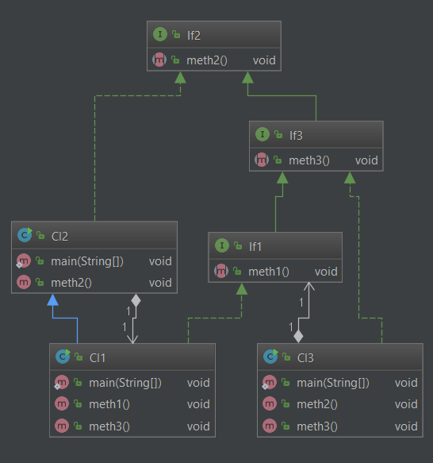
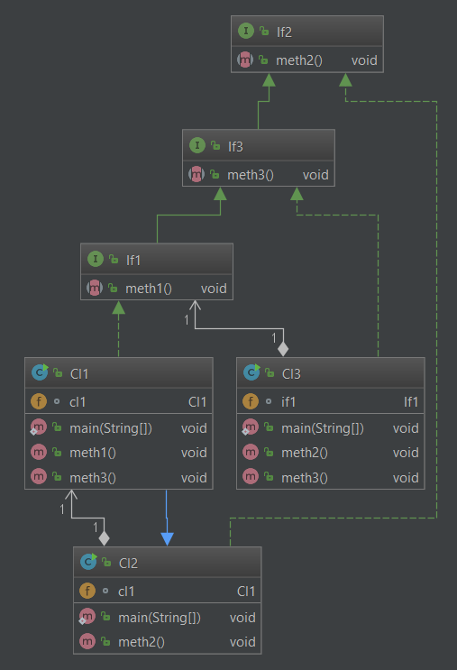
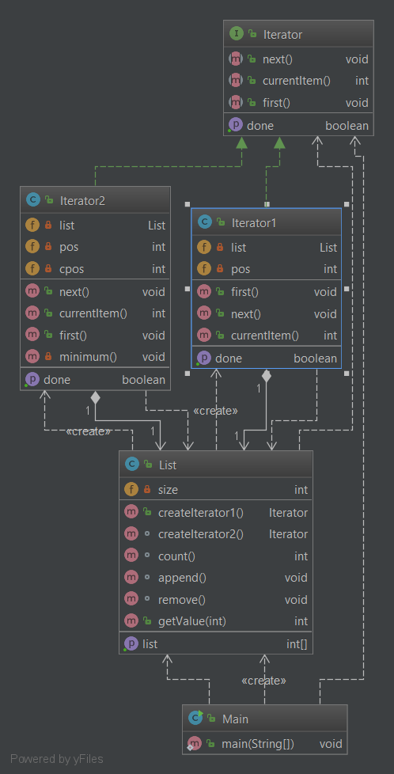
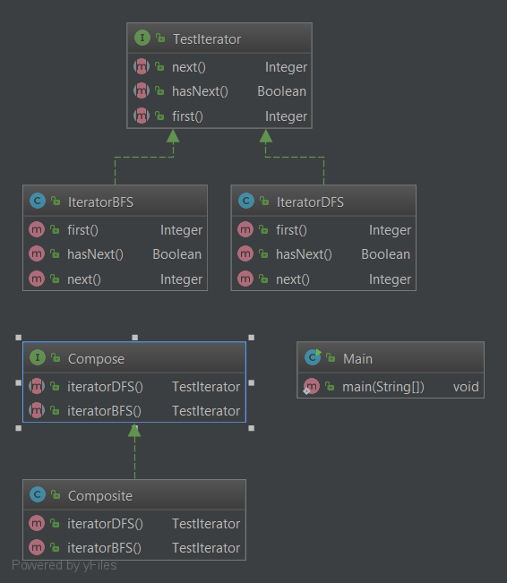

# Software Engineering Labs (1,2,5,8)

This repository contains ready first, second, fifth and eighth laboratory works, others were made separately, because they are quite extensive and important projects.

## Prerequisites

1. [Apache Ant](https://ant.apache.org/bindownload.cgi)
2. [IntelliJ IDEA](https://www.jetbrains.com/idea/download/#section=windows)
3. [Basic knowledge in Design Patterns](https://refactoring.guru/design-patterns)

<h3 align="center">Lab 1</h3> 

<b>Objective:</b> To acquire basic skills in using the XML language. Study of the structure of a typical software project, formats of standard project description files. Study of JAR format. Gaining skills in using tools to automate the process of assembling software projects in Java - Apache ANT (Another Neat Tool).

<b>General Task:</b> 

1. Learn the syntax and structure of the XML language. Be able to edit XML files in a text editor.

2. Get acquainted with the purpose and structure of JAR archives. Be able to create JAR archives and run Java classes from the JAR archive using command line tools.

3. Get acquainted with the means of automating the collection of ANT projects. Examine the purpose and structure of the `build.xml` file, its structural components - goals, objectives, dependencies, etc.

4. Get acquainted with the directory structure of a typical project, XML-files of the project description (`.project`, `.classpath`, `build.xml`).

5. Modify the `build.xml` file so that it has all the necessary goals, freely know the purpose of each goal.

<b>Main Task:</b> Delete from the project all files with extensions `.tmp`, `.jar`, `.class` except those starting with the letter "a".

<details>
  <summary>Implementation of `build.xml`</summary>
```xml
<project name="SE-Labs" default="delete-files" basedir=".">

    <!-- ================== Application Properties =================== -->
    <property name="app.name" value="SE-Labs" />
    <property name="app.version" value="1.0" />
    <property name="app.title" value="Software Engineering Labs" />
    <property name="app.author" value="Jack Shendrikov" />
    <property name="app.company" value="jackshenua" />

    <property name="sourceDir" value="src" />
    <property name="outputDir" value="out/eclipse-classes" />
    <property name="buildDir" value="out/build" />
    <property name="resourceDir" value="src/res" />
    <property name="libDir" value="lib" />

    <!-- ================== JAR Properties =================== -->
    <property name="jar.mainClass" value="ua.jackshen.TestMain" />
    <property name="jar.name" value="${app.name}.jar" />
    <property name="jar.keyStore" value="${basedir}/out/tempKey.store" />
    <property name="jar.keyPass" value="telpat" />
    <property name="jar.keyAlias" value="tempAlias" />

    <!--  ==================== Compilation Control Options ==================== -->
    <property name="compile.debug"       value="true"/>
    <property name="compile.deprecation" value="false"/>
    <property name="compile.optimize"    value="true"/>
    <path id="compile.classpath">
        <fileset dir="${libDir}">
            <include name="*.jar"/>
        </fileset>
    </path>

    <!-- ==================== Clean Target ================================== -->
    <target name="clean"
            description="Clean build dirs">
        <delete dir="${buildDir}" />
    </target>

    <!-- ==================== Prepare Target ================================== -->
    <target name="prepare"
            depends="clean"
            description="Prepare build dirs">
        <mkdir  dir="${buildDir}"/>
        <mkdir  dir="${buildDir}/output"/>
        <mkdir  dir="${buildDir}/web-apps"/>
    </target>

    <!-- ==================== Compile Target ================================== -->
    <target name="compile"
            depends="prepare"
            description="Compile Java sources">

        <javac srcdir="${sourceDir}"
               destdir="${buildDir}/output"
               debug="${compile.debug}"
               deprecation="${compile.deprecation}"
               optimize="${compile.optimize}"
               target="1.8"
               source="1.8"
               includeantruntime="false">
            <classpath refid="compile.classpath"/>
        </javac>

        <copy  todir="${buildDir}/output">
            <fileset dir="${sourceDir}" excludes="**/*.java"/>
        </copy>
    </target>

    <!-- ==================== Create JAR archive Target ================================== -->
    <target name="createJAR"
            depends="compile"
            description="Create JAR archive" >
        <jar destfile="${buildDir}/${jar.name}" basedir="${outputDir}">
            <manifest>
                <attribute name="Created-By" value="${app.author} - (${app.company})"/>
                <attribute name="Built-By" value="${user.name}"/>
                <attribute name="Main-Class" value="${jar.mainClass}"/>
                <section name="${app.name}">
                    <attribute name="Specification-Title" value="${app.title}"/>
                    <attribute name="Specification-Version" value="${app.version}"/>
                    <attribute name="Specification-Vendor" value="${app.company}"/>
                    <attribute name="Implementation-Title" value="${app.name}"/>
                    <attribute name="Implementation-Version" value="${app.version}"/>
                    <attribute name="Implementation-Vendor" value="${app.company}"/>
                </section>
            </manifest>
        </jar>
    </target>

    <!-- ==================== Generate Key for JAR signing Target ================================== -->
    <target name="generateKey"
            description="Generates Key for JAR signing">
        <delete failonerror="false" file="${jar.keyStore}"/>
        <genkey keystore="${jar.keyStore}" alias="${jar.keyAlias}" storepass="${jar.keyPass}" validity="720" keyalg="RSA">
            <dname>
                <param name="CN" value="${app.company}"/>
                <param name="OU" value="${app.title}"/>
                <param name="O"  value="${app.company}"/>

            </dname>
        </genkey>
    </target>


    <!-- ==================== FixStyle Target ================================== -->
    <target name="fixstyle"
            description="Fix Style in source code" >
        <fixcrlf srcdir="${basedir}"
                 tab="remove"
                 tablength="2"
                 includesfile="fixstyle.list"
        />
    </target>

    <!-- ==================== JAR Singing Target ================================== -->
    <target name="signJAR"
            depends="createJAR,generateKey"
            description="Signing JAR archive">
        <exec dir="${buildDir}" executable="jarsigner">
            <arg line="-keystore ${jar.keyStore} -storepass ${jar.keyPass} ${jar.name} ${jar.keyAlias}"/>
        </exec>
        <delete file="${buildDir}/myKeystore" />
    </target>


    <!-- ==================== Make zip Target ================================== -->
    <target name="make-zip-project"
            description="Zip all project tree from basedir">
        <tstamp />
        <zip destfile="../${app.name}-${DSTAMP}-${TSTAMP}.zip"
             basedir="${basedir}"
             excludes="out/**"/>
    </target>

    <!-- ==================== Delete files Target ================================== -->
    <target name="delete-files" depends="signJAR" description="Delete jar, tmp, class file except first a in name">
        <echo>Files successfully deleted!</echo>
        <delete>
            <fileset dir="." includes="**/*.jar" excludes="**/a*.jar" />
            <fileset dir="." includes="**/*.tmp" excludes="**/a*.tmp" />
            <fileset dir="." includes="**/*.class" excludes="**/a*.class" />
        </delete>
    </target>

    <!-- ==================== generate doc by javadoc Target ================================== -->
    <target name="generate-javadoc" depends="delete-files"
            description="Zip all project tree from basedir">
        <javadoc sourcepath="${sourceDir}" destdir="doc" author="yes" version="yes" access="private">
        </javadoc>
    </target>

</project>

```
</details>

<h3 align="center">Lab 2</h3> 

<b>Objective:</b> Introduction to the types of UML charts. Gaining basic skills in using a UML class diagram. Gaining skills in the use of automation tools for UML modeling.

<b>General Task:</b> 

1. Get acquainted with the purpose and types of UML diagrams. To study the diagram of classes, to own elements and relations between them freely. Be able to build class diagrams for Java source code, as well as generate raw code equivalent to a given class diagram.

2. Construct a class diagram containing three interfaces `If1`, `If2`, `If3` with methods `meth1()`, `meth2()`, `meth3()`and classes that implement them `Cl1`, `Cl2`, `Cl3`, respectively.

3. According to the option to implement the generalization and aggregation relations on the class diagram.

4. The implementation of methods should display the class name and method name on the console).

5. Get acquainted with the means of automation of UML-modeling.

<b>Main Task:</b> 

Generalization: `If1 <- If3; If3 <- If2; Cl1 <- Cl2`

Aggregation: `If1 <- Cl3; Cl1 <- Cl2; Cl1 <-Cl1`

<details>
  <summary>Pre-Developed Class Diagram</summary>
<p align="center">
    
</p>
</details>

<details>
  <summary>Сlass Вiagram Based On The Raw Code Of The Developed Programs</summary>
<p align="center">
    
</p>
</details>


<h3 align="center">Lab 5</h3> 

<b>Objective:</b> Introduction to the types of software design templates. Study of behavioral design patterns. Gain basic skills in using `Iterator`, `Mediator` and `Observer` templates.

<b>General Task:</b> 

1. Examine behavior patterns for software design. Know the general characteristics of behavior patterns and the purpose of each of them.

2. Examine in detail the behavior patterns for software design - `Iterator`, `Mediator` and `Observer`. For each of them:
	* study the template, its purpose, alternative names, motivation, cases when its use is appropriate and the results of such use;
	* know the features of the template, related templates, known cases of its use in software applications;
	* be fluent in the structure of the template, the purpose of its classes and the relationship between them;
	* be able to recognize a template in a UML class diagram and build raw codes of Java classes that implement the template.

3. Develop interfaces and classes that implement tasks (according to the option) using one or more templates. Fully implement the methods related to the functioning of the template in the developed classes.

<b>Main Task:</b> Define class specifications that encapsulate a linear list of integers and implement the possibility of normal sequential traversal and sequential traversal in an ordered structure.

To implement this lab was used `Iterator` pattern.

<details>
  <summary>Class Diagram</summary>
<p align="center">
    
</p>
</details>


<h3 align="center">Lab 8</h3> 

<b>Main Task:</b> Define class specifications for the implementation of the composite and its iterators - to bypass the structure by depth search methods (DFS) and breadth (BFS).

<details>
  <summary>Class Diagram</summary>
<p align="center">
    
</p>
</details>
